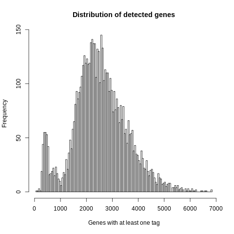
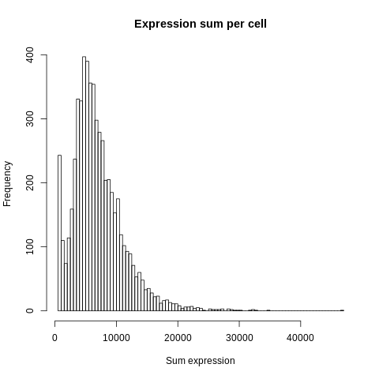
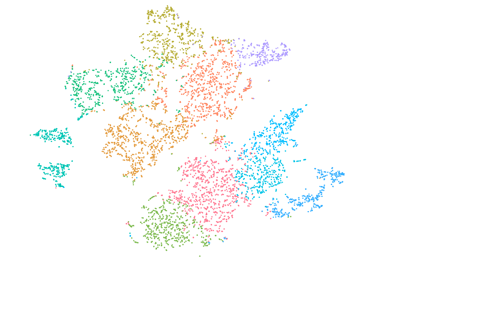
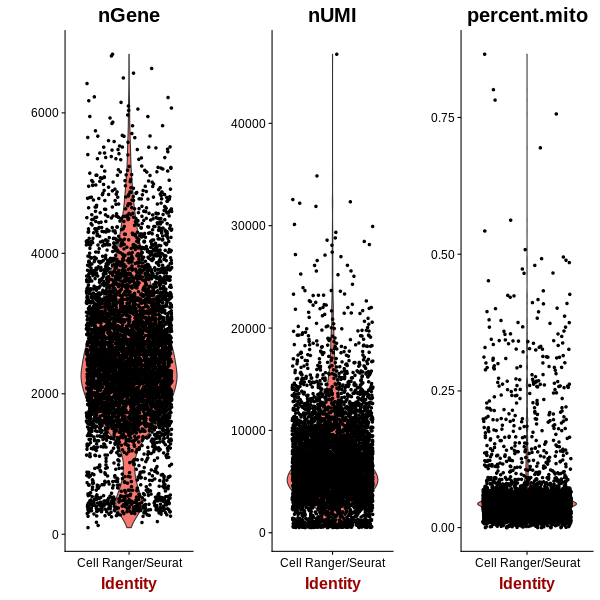

==============================================================================
**D: Cell Ranger based general plots before filtering**
==============================================================================

.. ::  

.. image:: dsummary.html  
  :width: 400
  :alt: Click here to view cell ranger summary for Sample D 

    
 

