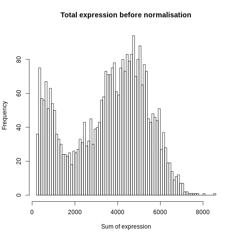
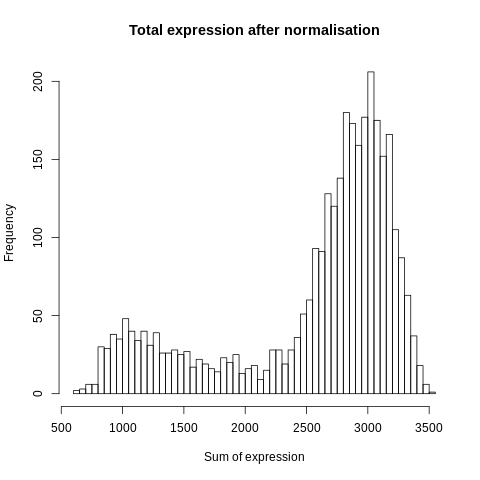
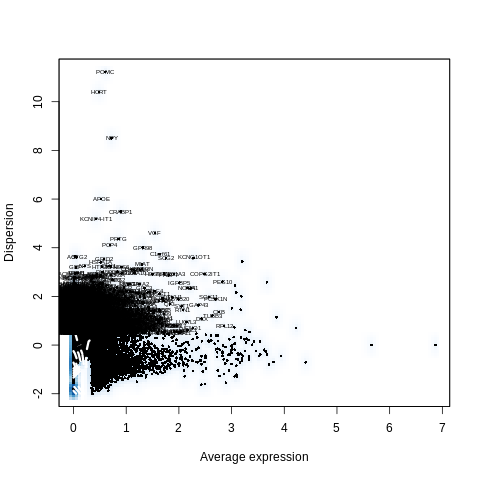
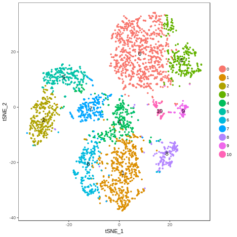

=============================
**Sample SIGAD1 Plots**
=============================

Cell Ranger Summary and Clustering
----------------------------------------
.. image:: dsummary.html  
  :width: 400
  :alt: D summary 

.. raw:: html

    

.. raw:: html 

     

.. image:: dloupe.png  
     :width: 400

.. raw:: html

    

.. raw:: html 

    

UMI Tools Clustering and Plots 
----------------------------------

.. figure:: Dplot_cell_barcode_counts.png  
  :width: 400px
  :align: center 
  :height: 400px
  :alt: Cell Barcode Counts

  Cell Barcode Counts

    Before Normalization 

    After Normalization 

    Dispersion

