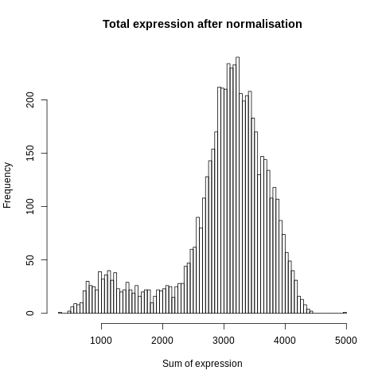
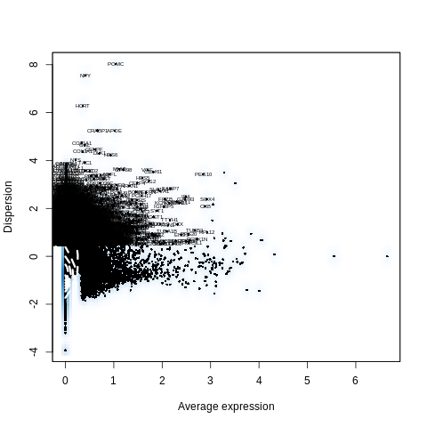
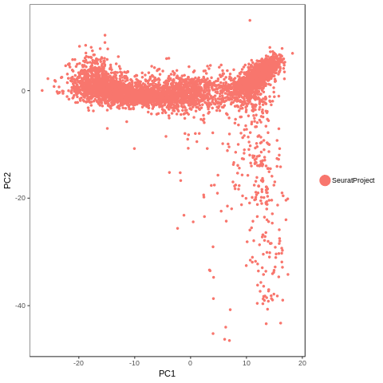
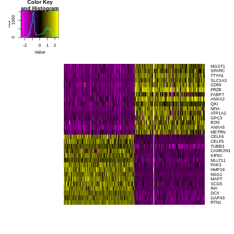
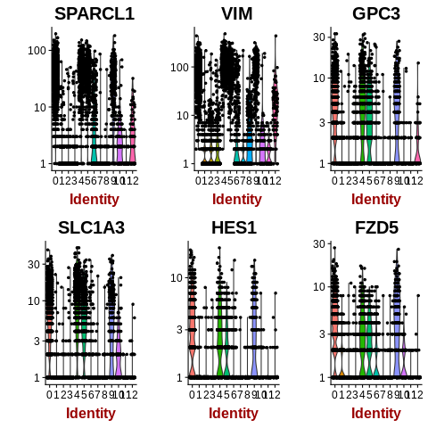
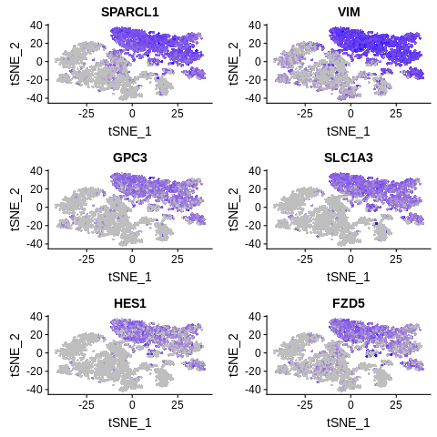

=========================================================================================================================
**E: UMI/Seurat - Cells with genes <100 are filtered**
=========================================================================================================================

.. figure:: e100.before.hist.png
    :width: 500px
    :align: center
    :height: 500px
    :alt: Before Normalization
    :figclass: align-center

    Before Normalization 

    After Normalization 

    Dispersion

  
   PCA for sample E

.. figure:: e100.tsne.cluster.png
   :width: 600px 
   :align: center 
   :height: 600px 
   :alt: TSNE Clustering
   :figclass: align-center

   TSNE Clustering 

   Heatmap of sample E

.. figure:: e100.heatmap2.png 
   :width: 600px
   :align: center 
   :height: 600px 
   :alt: Heatmaps of PCAs of Sample E
   :figclass: align-center
 
   Heatmaps of PCAs of sample E

.. figure:: e100.vnplot.pca.png  
   :width: 600px
   :align: center
   :height: 600px
   :alt: VNPlot for top PCA genes 
   :figclass: align-center
  
   VNPlot for top PCA genes 

.. figure:: e100.featureplot.pca.png
   :width: 600px 
   :align: center 
   :height: 600px 
   :alt: Feature Plot for top PCA genes 
   :figclass: align-center

   Feature Plot for top PCA genes 

   
   VNPlot for top Marker genes 

 
   Feature Plot for top Marker genes 
   
