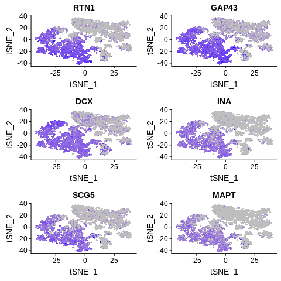

=========================================================================================================================
**E: UMI/Seurat - Cells with genes <100 are filtered**
=========================================================================================================================

    Before Normalization 

    After Normalization 

.. figure:: e100.dispersion.png 
    :width: 400px
    :align: center
    :height: 400px
    :alt: Dispersion 
    :figclass: align-center

    Dispersion

  
   PCA for sample E

   TSNE Clustering 

   Heatmap of sample E

 
   Heatmaps of PCAs of sample E

.. figure:: e100.vnplot.pca.png  
   :width: 600px
   :align: center
   :height: 600px
   :alt: VNPlot for top PCA genes 
   :figclass: align-center
  
   VNPlot for top PCA genes 

   Feature Plot for top PCA genes 

   
   VNPlot for top Marker genes 

.. figure:: e100.featureplot.marker.png
   :width: 600px 
   :align: center 
   :height: 600px
   :alt: Feature Plot for top Marker genes
   :figclass: align-center
 
   Feature Plot for top Marker genes 
   
