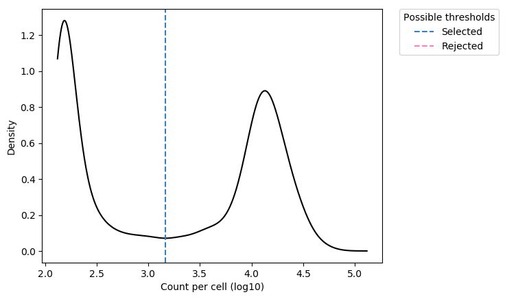

=========================================================================================================================
**E: UMI/Seurat - Cells with genes <100 are filtered**
=========================================================================================================================

.. figure:: e.geneswith1tr.png
   :width: 800px
   :align: center 
   :height: 400px
   :alt: Distribution of Deteced Genes

   Detected Genes: genes that have at least one transcript in each cell

     Sum of Expression 

.. figure:: Eplot_cell_barcode_counts.png  
  :width: 800px
  :align: center 
  :height: 400px
  :alt: Cell Barcode Counts

  Cell Barcode Counts

   Sample E density Plot

.. figure:: e2.before.hist.png
    :width: 500px
    :align: center
    :height: 500px
    :alt: Before Normalization
    :figclass: align-center

    Before Normalization 

.. figure:: e2.after.hist.png
    :width: 500px
    :align: center
    :height: 500px
    :alt: After Normalization 
    :figclass: align-center

    After Normalization 

    Dispersion

.. figure:: e2.pca.png 
   :width: 600px 
   :align: center 
   :height: 400px 
   :alt: PCA for sample E
   :figclass: align-center
  
   PCA for sample E

.. figure:: e2.tsne.cluster.png
   :width: 600px 
   :align: center 
   :height: 600px 
   :alt: TSNE Clustering
   :figclass: align-center

   TSNE Clustering 

.. figure:: e2.heatmap1.png 
   :width: 600px
   :align: center 
   :height: 600px 
   :alt: Heatmap of Sample E 
   :figclass: align-center

   Heatmap of sample E

.. figure:: e2.heatmap2.png 
   :width: 600px
   :align: center 
   :height: 600px 
   :alt: Heatmaps of PCAs of Sample E
   :figclass: align-center
 
   Heatmaps of PCAs of sample E

  
   VNPlot for top PCA genes 

.. figure:: e2.featureplot.pca.png
   :width: 600px 
   :align: center 
   :height: 600px 
   :alt: Feature Plot for top PCA genes 
   :figclass: align-center

   Feature Plot for top PCA genes 

.. figure:: e2.vnplot.marker.png 
   :width: 600px 
   :align: center 
   :height: 600px 
   :alt: VNPlot for top Marker genes 
   :figclass: align-center
   
   VNPlot for top Marker genes 

 
   Feature Plot for top Marker genes 
   
