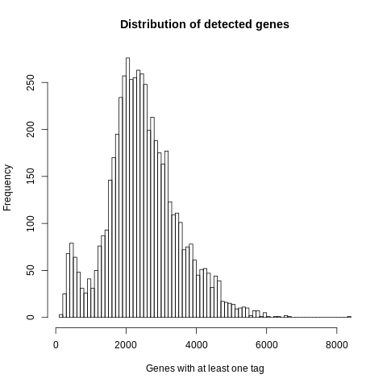
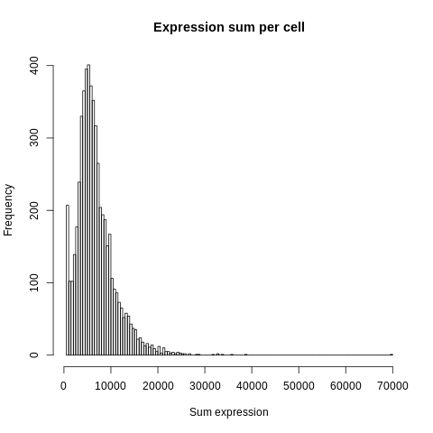
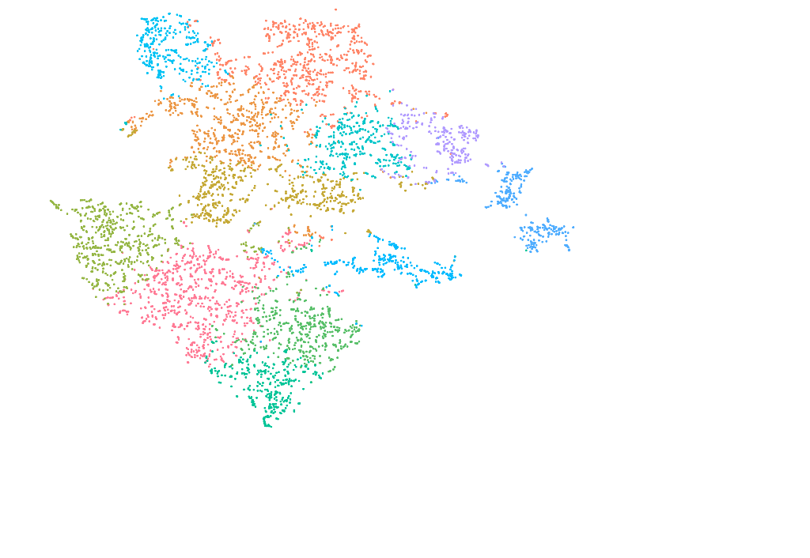
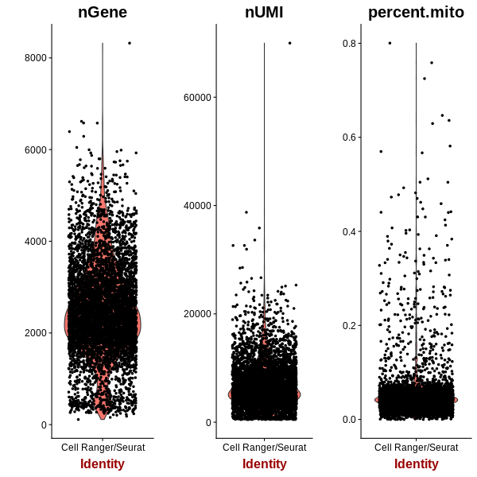

==============================================================================
**E: Cell Ranger based general plots before filtering**
==============================================================================

.. ::  

  

.. image:: esummary.html  
  :width: 400
  :alt: Click here to view cell ranger summary for Sample E

     

