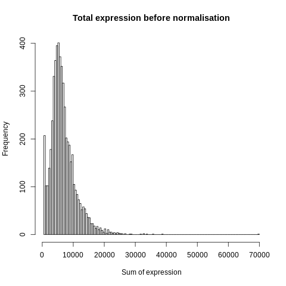
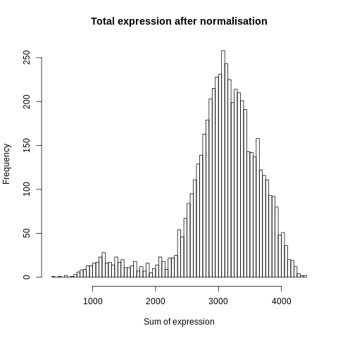
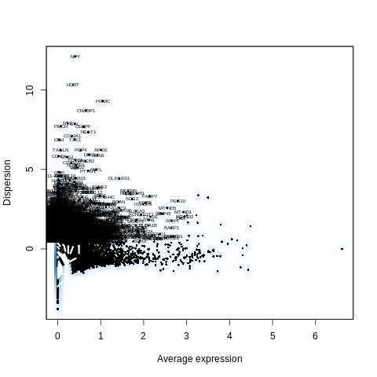
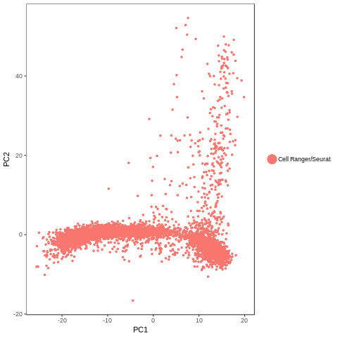
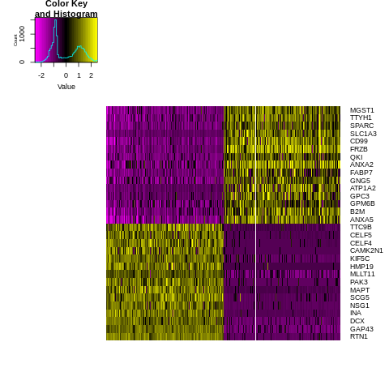
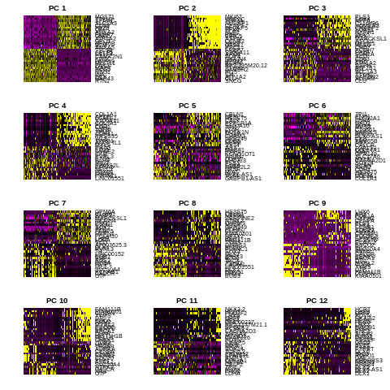
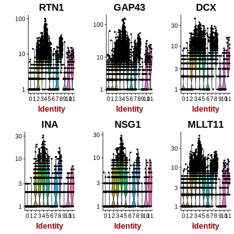
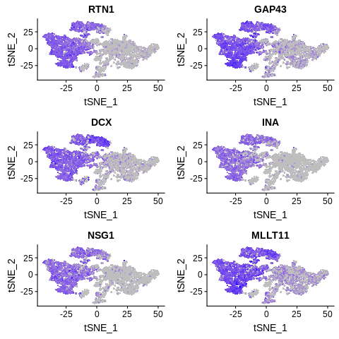
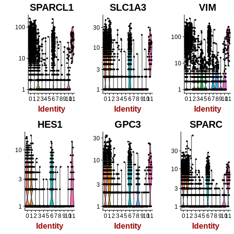
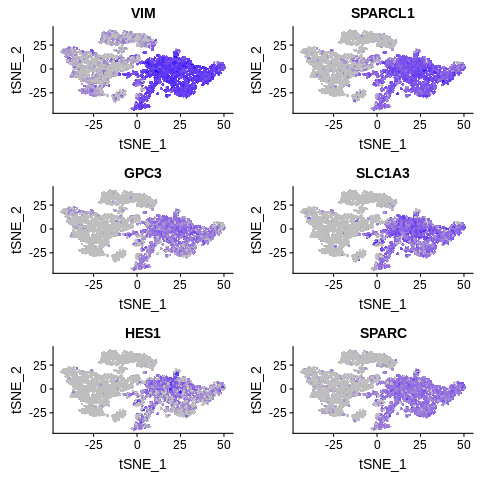

==============================================================================
**E: Cell Ranger/Seurat - Cells with genes <100 are filtered**
==============================================================================

.. ::  

  

    Before Normalization 

    After Normalization 

    Dispersion

  
   PCA for sample E

.. figure:: eCR.tsne.cluster.png
   :width: 600px 
   :align: center 
   :height: 600px 
   :alt: TSNE Clustering
   :figclass: align-center

   TSNE Clustering 

   Heatmap of sample E

 
   Heatmaps of PCAs of sample E

  
   VNPlot for top PCA genes 

   Feature Plot for top PCA genes 

   
   VNPlot for top Marker genes 

 
   Feature Plot for top Marker genes 
   

