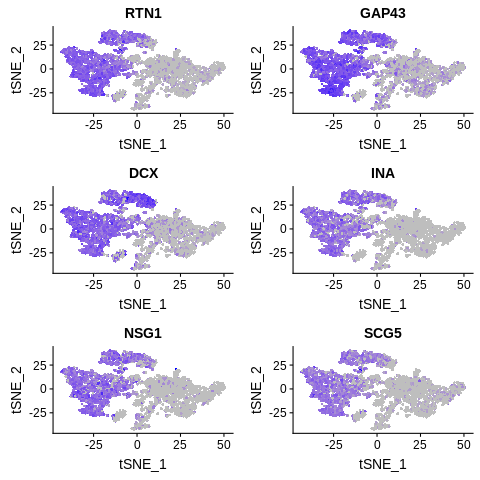
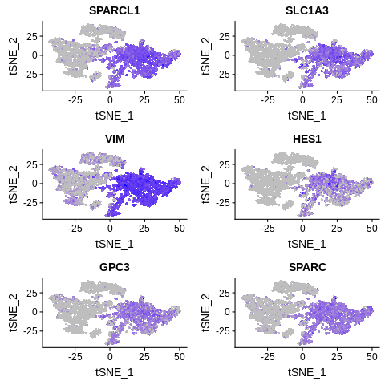

==============================================================================
**E: Cell Ranger/Seurat - Cells with genes <100 are filtered**
==============================================================================

.. ::  

  

.. figure:: eCR.before.hist.png
    :width: 500px
    :align: center
    :height: 500px
    :alt: Before Normalization
    :figclass: align-center

    Before Normalization 

.. figure:: eCR.after.hist.png
    :width: 500px
    :align: center
    :height: 500px
    :alt: After Normalization 
    :figclass: align-center

    After Normalization 

    Dispersion

  
   PCA for sample E

.. figure:: eCR.tsne.cluster.png
   :width: 600px 
   :align: center 
   :height: 600px 
   :alt: TSNE Clustering
   :figclass: align-center

   TSNE Clustering 

.. figure:: eCR.heatmap1.png 
   :width: 600px
   :align: center 
   :height: 600px 
   :alt: Heatmap of Sample E
   :figclass: align-center

   Heatmap of sample E

 
   Heatmaps of PCAs of sample E

.. figure:: eCR.vnplot.pca.png  
   :width: 600px
   :align: center
   :height: 600px
   :alt: VNPlot for top PCA genes 
   :figclass: align-center
  
   VNPlot for top PCA genes 

   Feature Plot for top PCA genes 

.. figure:: eCR.vnplot.marker.png 
   :width: 600px 
   :align: center 
   :height: 600px 
   :alt: VNPlot for top Marker genes 
   :figclass: align-center
   
   VNPlot for top Marker genes 

 
   Feature Plot for top Marker genes 
   

