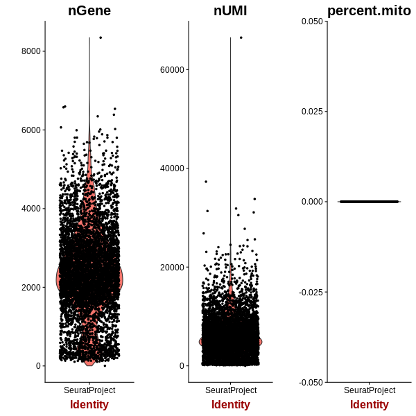

=========================================================================================================================
**E: UMITool based general plots before filtering**
=========================================================================================================================

#Althoug no filtering but their run from e100 is more reviewed and they are run before the filtering step

.. figure:: e100.sumexpression.png 
   :width: 500px
   :align: center 
   :height: 500px
   :alt:  Expression sum per cell 

.. figure:: Eplot_cell_barcode_counts.png  
  :width: 800px
  :align: center 
  :height: 400px
  :alt: Cell Barcode Counts

.. figure:: Eplot_cell_barcode_count_density.png
   :width: 800px 
   :align: center 
   :height: 400px
   :alt: Density 

   
