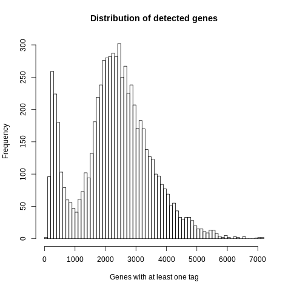
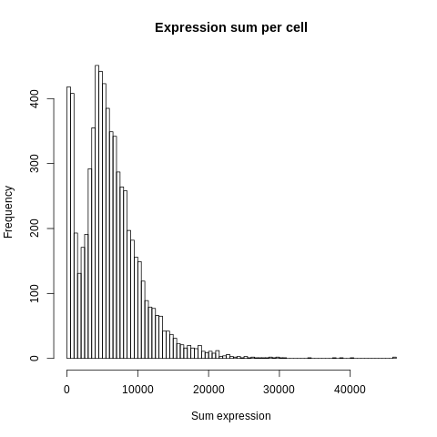
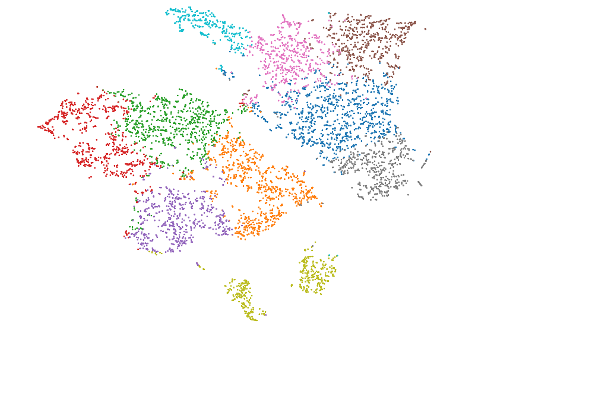
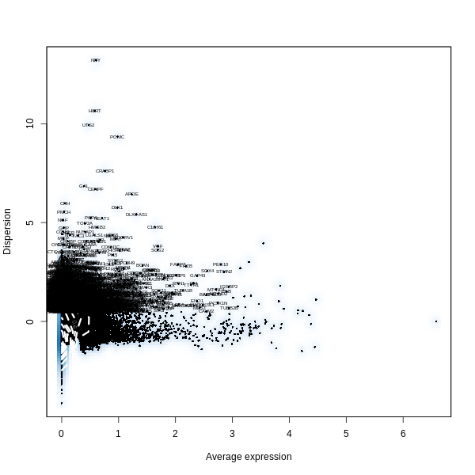

==============================================================================
**F: Cell Ranger based general plots before filtering**
==============================================================================

.. ::  

   Detected Genes: genes that have at least one transcript in each cell

     Sum of Expression 

  

.. image:: fsummary.html  
  :width: 400
  :alt: Click here to view cell ranger summary for Sample F

     

     Cell Ranger Clusters of Sample F

   

     :align: center 
     :alt: Mitocondorial 

     Check Mitocondorila Genes

