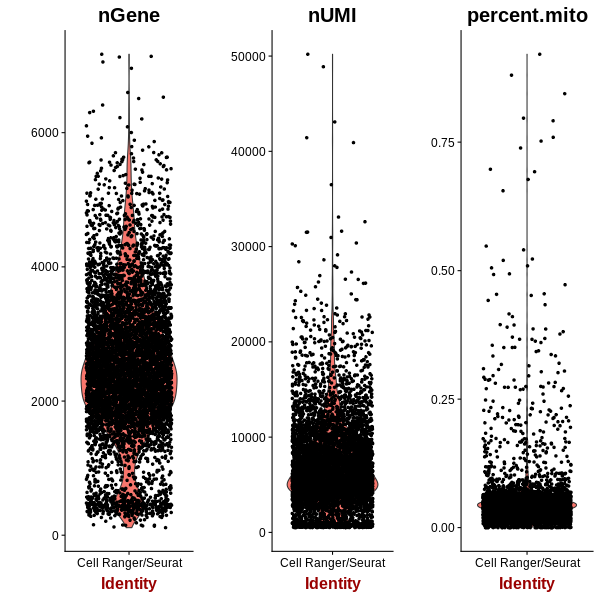

==============================================================================
**F: Cell Ranger based general plots before filtering**
==============================================================================

.. ::  

.. figure:: f.geneswith1tr.png
   :width: 500px
   :align: center 
   :height: 500px
   :alt: Distribution of Deteced Genes

   Detected Genes: genes that have at least one transcript in each cell

     Sum of Expression 

  

.. image:: fsummary.html  
  :width: 400
  :alt: Click here to view cell ranger summary for Sample F

.. figure:: floupe.png  
     :width: 400
     :height: 400px
     :alt: Cell Ranger Clusters for F
     

     Cell Ranger Clusters of Sample F

   

     :align: center 
     :alt: Mitocondorial 

     Check Mitocondorila Genes

