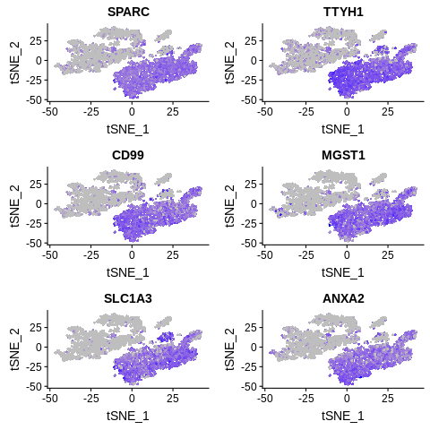
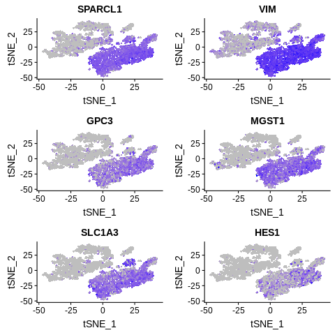

==============================================================================
**F: Cell Ranger/Seurat - Cells with genes <100 are filtered**
==============================================================================

.. ::  

    Before Normalization 

    After Normalization 

    Dispersion

.. figure:: fCR.pca.png 
   :width: 600px 
   :align: center 
   :height: 400px 
   :alt: PCA for sample F
   :figclass: align-center
  
   PCA for sample F

   TSNE Clustering 

   Heatmap of sample F

 
   Heatmaps of PCAs of sample F

  
   VNPlot for top PCA genes 

   Feature Plot for top PCA genes 

   
   VNPlot for top Marker genes 

 
   Feature Plot for top Marker genes 
   

