=======================================================================================================================
**G: UMI/Seurat - Cells with genes <100 are filtered**
=======================================================================================================================

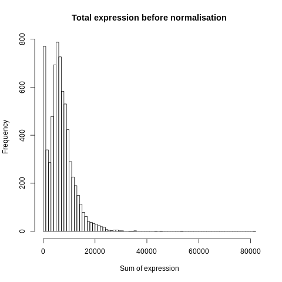

    Before Normalization 

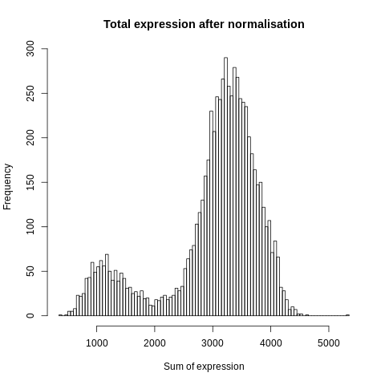

    After Normalization 

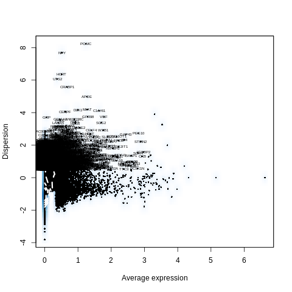

    Dispersion

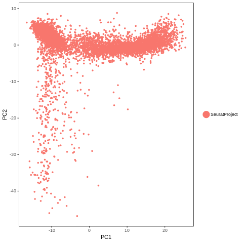
  
   PCA for sample G

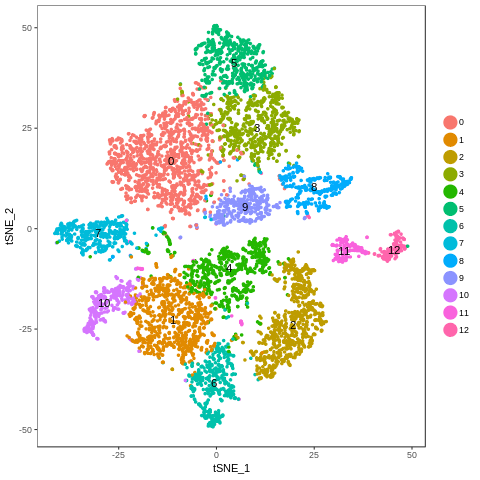

   TSNE Clustering 

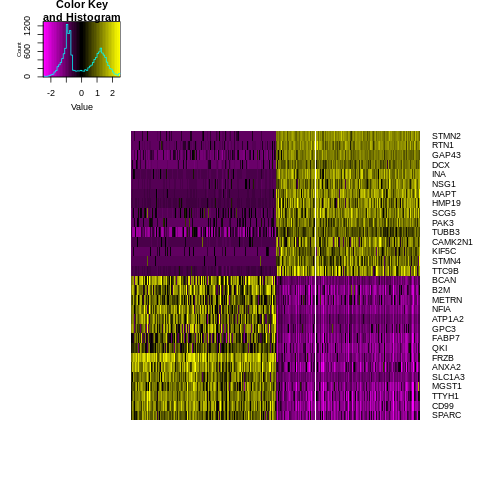

   Heatmap of sample G

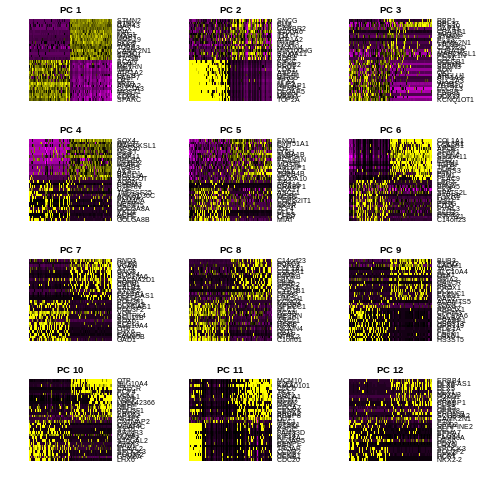
 
   Heatmaps of PCAs of sample G

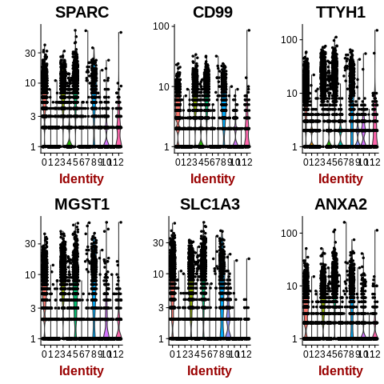
  
   VNPlot for top PCA genes 

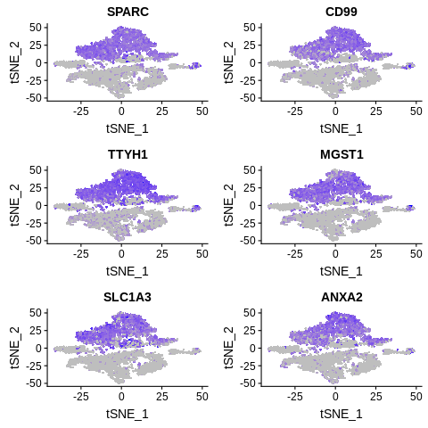

   Feature Plot for top PCA genes 

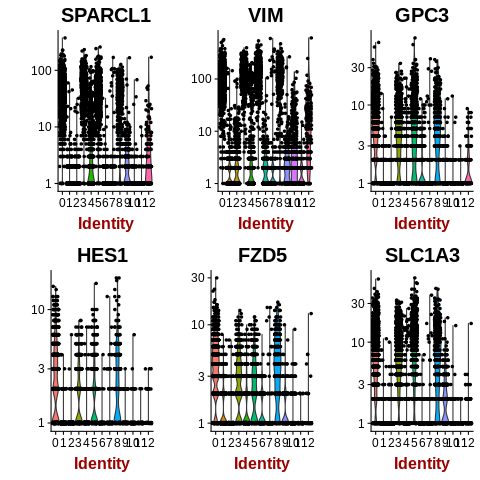
   
   VNPlot for top Marker genes 

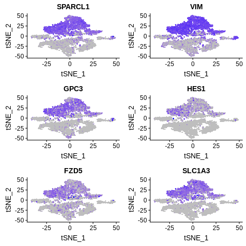
 
   Feature Plot for top Marker genes 
   
