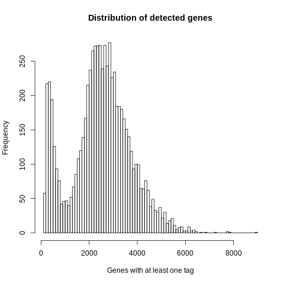
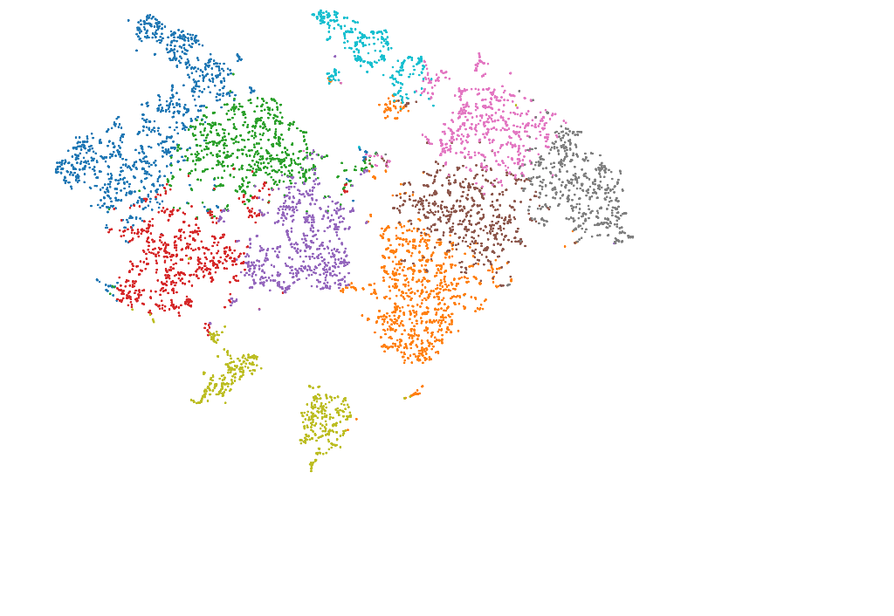
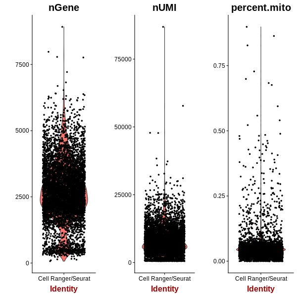

==============================================================================
**G: Cell Ranger based general plots before filtering**
==============================================================================

.. ::  

  

   Detected Genes: genes that have at least one transcript in each cell

.. figure:: g.sumexpression.png 
   :width: 500px
   :align: center 
   :height: 500px
   :alt:  Expression sum per cell 

     Sum of Expression 

.. image:: gsummary.html  
  :width: 400
  :alt: Click here to view cell ranger summary for Sample G 

     

     Cell Ranger Clusters of Sample G

  

     :align: center 
     :alt: Mitocondorial 

     Check Mitocondorila Genes

 

